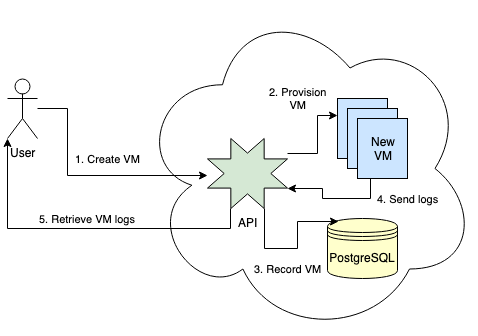

# Azure Virtual Machine Creator and systemd Logging

### Index

* [Description](#description)
* [Azure components used in development](#azure-components-used-in-development)
* [Design decisions](#design-decisions)
    * [Web API](#web-api)
    * [Persistent data storage](#persistent-data-storage)
    * [Provisioned VMs](#provisioned-vms)
    * [Container-based architecture](#container-based-architecture)
* [API reference](#api-reference)

### Description

Create a Linux Virtual Machine in Azure and retrieve systemd journal logs with a RESTful web API.

The web API is used to provision a Virtual Machine (and accompanying resource group, network stack, and custom script extension). The API will record the created VM, and the custom script exctension will stream systemd journal entries from the provisioned VM back to the web API. The end user will only have to initiate HTTP requests to the web service to retrieve these systemd boot events, optionally filtering by unit.

## Azure components used in development

* Azure App Service Plan on Linux
* Azure App Service (Docker container)
* Azure Database for PostgreSQL
* Azure Linux VM (target provisioned machines)

## Design diagram

## Design decisions

### Web API

The web API is developed in Python using Flask.

### Persistent data storage

In order to maintain the state for provisioned VMs and their systemd journal events, a PostgreSQL database is used. The database primarily consists of two main tables: One for managing the VMs themselves, and the other for recording the systemd events. This software is designed to keep the raw events so that we have the original data. For data aggregations, the API can be consumed or developed further to provide that functionality. At the moment, the API only supports filtering the messages by systemd unit.

### Provisioned VMs

This architecture relies heavily on the custom script extension for a Linux VM. I chose a "push" method for the systemd journal events, as this allowed a natural flow from source to destination. The custom script extension does two things:

1. On startup it'll pass all of the previous journal log entries from current boot to now to the Flask web API
1. Wait every 5 seconds, and then retrieve and pass the last 5 seconds of journal events to the Flask web API

This allows a fairly constant stream of journal events from the VM to the API. 5 seconds appears to be a good amount of delay time so that the end user isn't waiting too long for log messages (close to real time), but also not too short where the VM is too chatty with the API.

### Container-based architecture

From the start of development, a container was used for the Flask web API. This allowed for a consistent experience, from developing on my workstation to deploying to Azure.

## API reference

* `[GET] /` - Default route displaying the application name
* `[POST] /vm/<name>/<size>` - Create a virtual machine with `name` and `size` (options are `small`, `medium`, and `large`)
* `[GET] /vm` - List all provisioned virtual machines
* `[GET] /vm/<name>` - Get a virtual machine and specs
* `[GET] /vm/<name>/boot` - Get all systemd events for the VM `name`
* `[GET] /vm/<name>/boot/<unit>` - Get systemd events for VM `name` for a particular `unit`
* `[POST] /vm/<name>/boot` - Add a systemd event to the API (**Note: this is reserved for provisioned VM usage**)
